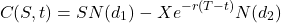

# Option Pricing v1
A basic Option Pricing interface that relies on Black-Scholes Equation

# Introduction: the Black-Scholes Equation

Black-Scholes Equation is one of the most important discoveries of modern finance. 
It is a  Stochastic Differential Equation ("SDE") useful to derive the implied price of an option:

